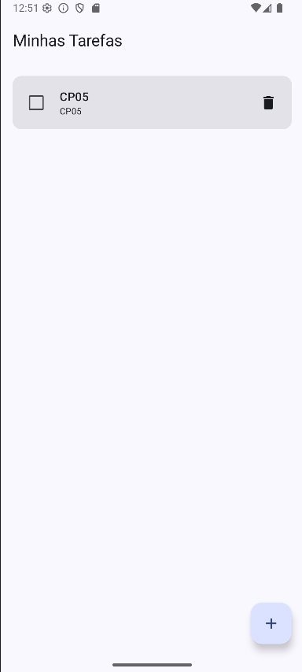
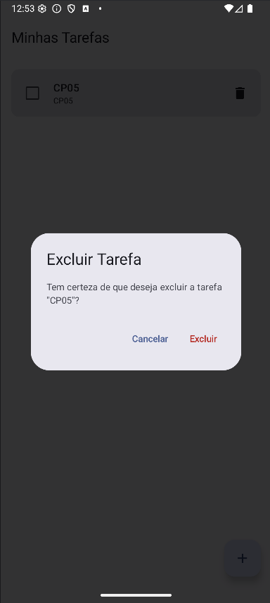
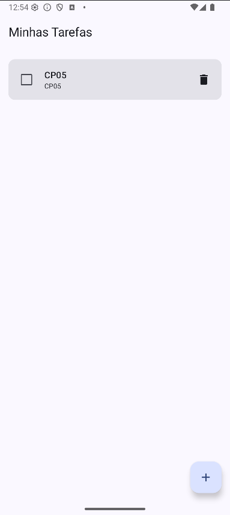
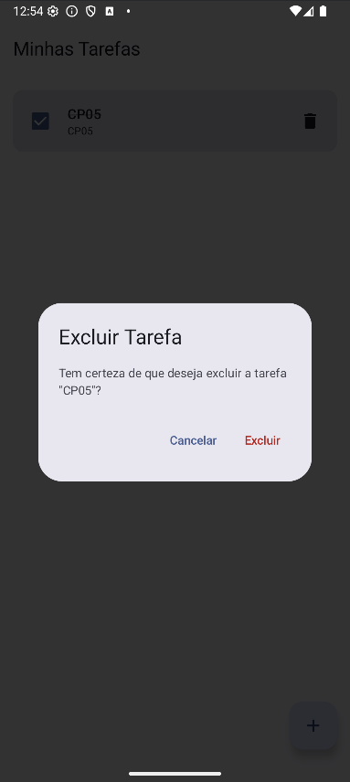
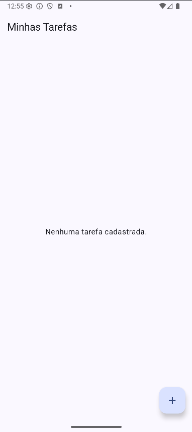

# Evidências - Confirmação de Exclusão de Tarefas

## Descrição da Implementação

Foi implementado um fluxo seguro de confirmação antes da exclusão definitiva de tarefas no aplicativo To-Do List:

1. **Diálogo de Confirmação (Jetpack Compose Material 3):** Ao tocar no ícone de lixeira, um `AlertDialog` é exibido em camada sobre a tela da lista, sem transição para uma nova tela.
2. **Identificação da Tarefa:** O diálogo informa claramente sobre a exclusão e apresenta o título da tarefa selecionada.
3. **Ações do Diálogo:**
   - **Cancelar:** Fecha o diálogo mantendo a lista inalterada.
   - **Excluir:** Remove apenas a tarefa selecionada do banco de dados/estado e fecha o diálogo.
4. **Arquitetura & Boas Práticas:** Mantida a arquitetura MVVM, persistência via Room, ordenação, regras de prazos/atrasos e inclusão de `@Preview` cobrindo o estado do diálogo.

---

## Sequência Obrigatória de Evidências (Emulador)

> **Como adicionar suas imagens:**  
> Salve as capturas de tela do emulador na pasta `docs/images/exclusao/` utilizando os nomes de arquivo descritos abaixo.

### 1. Lista antes da exclusão
*Demonstração da lista de tarefas cadastradas antes da ação de exclusão.*

---

### 2. Diálogo aberto com a tarefa selecionada
*Exibição do diálogo de confirmação informando o título da tarefa selecionada e as opções Cancelar e Excluir.*

---

### 3. Resultado ao cancelar
*Resultado visual na tela ao clicar em "Cancelar": o diálogo fecha e a lista de tarefas permanece intacta.*

---

### 4. Nova abertura do diálogo
*Demonstração da reabertura do diálogo de confirmação de exclusão.*

---

### 5. Resultado após confirmar a exclusão
*Resultado visual na lista após clicar em "Excluir": somente a tarefa selecionada é removida.*

